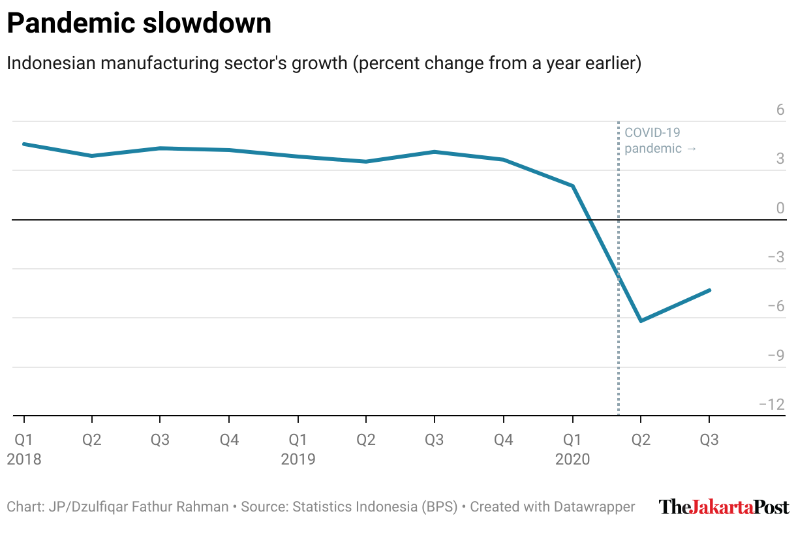

<!-- README.md is generated from README.Rmd. Please edit that file -->

```{r setup, include = FALSE}
knitr::opts_chunk$set(
  collapse = T,
  comment = "#>",
  message = F,
  fig.path = "man/figures/README-",
  fig.width = 4, 
  fig.asp = 0.618,
  fig.align = "center"
)
```

# jakpoststyle 

<!-- badges: start -->
[](https://lifecycle.r-lib.org/articles/stages.html#experimental)
[](https://github.com/dzulfiqarfr/jakpoststyle/actions)
[](https://codecov.io/gh/dzulfiqarfr/jakpoststyle?branch=main)
<!-- badges: end -->

The **jakpoststyle** package makes it easy to customize [Datawrapper](https://www.datawrapper.de/) charts (created with a free plan account) with the theme I usually use for [The Jakarta Post](thejakartapost.com). It builds on the [**DatawRappr**](https://github.com/munichrocker/DatawRappr) package developed by Benedict Witzenberger.

The functions are as follow:

- `jp_dw_theme()` edits the axes, byline and layout, as well as adds the Post’s logo;  
- `jp_dw_scale_x()` modifies the x-axis tick format and adds an axis line;  
- `jp_dw_scale_y()` modifies the y-axis elements, including truncating the scale; and  
- `jp_dw_c19_annotation()` creates COVID-19 text and line annotations.

## Installation

``` r
devtools::install_github("dzulfiqarfr/jakpoststyle")
```

## Getting started

The **jakpoststyle** package works on an existing Datawrapper chart. It requires the **DatawRappr** package, which allows you to use the Datawrapper's API through R.

```{r demo code, eval = F}
# Load the packages
library(DatawRappr)
library(jakpoststyle)

# Apply the theme
jp_dw_theme(
  chart_id,
  author = "Dzulfiqar Fathur Rahman",
  intro = "Indonesian manufacturing sector's growth (percent change from a year earlier)",
  source_name = "Statistics Indonesia (BPS)",
  source_url = "bps.go.id"
)

# Modify the x-axis
jp_dw_scale_x(
  chart_id,
  format = "quarterly",
  axis_line = TRUE
)

# Modify the y-axis
jp_dw_scale_y(
  chart_id,
  y_var = "growth",
  max = 6,
  min = "truncated",
  increment = 3
)

# Add COVID-19 annotations
jp_dw_c19_annotation(
  chart_id,
  y_position = 6
)
```
<br>
```{r demo chart, echo = F}

```


## R Markdown template

The package comes with an R Markdown template that describes my typical workflow when creating Datawrapper charts through R.

```{r rmd template, eval = F}
rmarkdown::draft("my_project.Rmd", template = "jakpoststyle", package = "jakpoststyle")
```

## Note

The package is optimized for line and column charts. Optimization for other chart types will, hopefully, follow in the future.

## Disclaimer

This is not an official template from The Jakarta Post.

## Resources

The package mainly uses the [`dw_edit_chart()`](https://munichrocker.github.io/DatawRappr/reference/dw_edit_chart.html) function from the **DatawRappr** package. You can also read Datawrapper's [API documentation](https://developer.datawrapper.de/reference).
