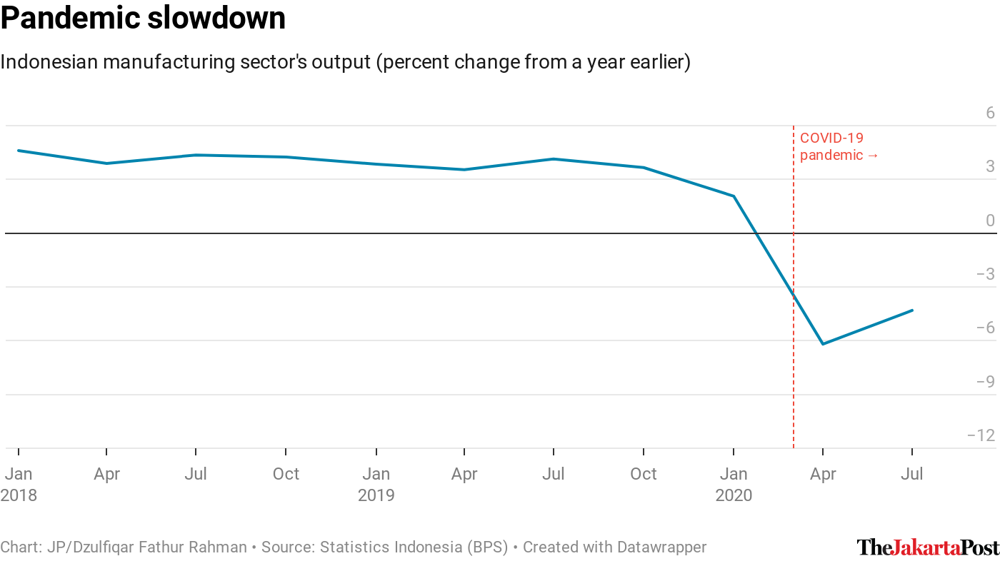

<!-- README.md is generated from README.Rmd. Please edit that file -->

```{r setup, include = FALSE}
knitr::opts_chunk$set(
  collapse = T,
  comment = "#>",
  message = F,
  fig.path = "man/figures/README-",
  fig.width = 4, 
  fig.asp = 0.618,
  fig.align = "center"
)
```

# jakpoststyle 

<!-- badges: start -->

<!-- badges: end -->

The **jakpoststyle** package makes it easy to customize [Datawrapper](https://www.datawrapper.de/) charts (created with a free plan account) using a custom theme of The Jakarta Post. It builds on the **DatawRappr** package developed by [Benedict Witzenberger](https://github.com/munichrocker).

The functions:

-   `jakpost_style()` adds a chart description, byline and The Jakarta Post's logo;  
-   `jp_scale_y()` modifies the y-axis elements, including truncating the scale; and  
-   `jp_covid_annotation()` creates COVID-19 text and line annotations.

## Installation

``` r
devtools::install_github("dzulfiqarfr/jakpoststyle")
```

## Getting started

**jakpoststyle** works on an existing Datawrapper chart. It requires the **DatawRappr** package, which allows you to use the Datawrapper's API through R.

```{r example, eval = F}
# Load the packages
library(DatawRappr)
library(jakpoststyle)

# Apply the custom theme
jakpost_style(
  chart_id,
  author = "Dzulfiqar Fathur Rahman",
  intro = "Indonesian manufacturing sector's output (percent change from a year earlier)",
  source_name = "Statistics Indonesia (BPS)",
  source_url = "bps.go.id"
)

# Modify the y-axis
jp_scale_y(
  chart_id,
  y = "growth",
  scale_y_max = 6,
  scale_y_min_rule = "truncated",
  scale_y_increment = 3
)

# Add COVID-19 pandemic line and text annotations
jp_covid_annotation(
  chart_id,
  covid_text_y = 6,
  text_color = "#ee493a",
  line_color = "#ee493a",
  line_type = "dashed"
)
```

```{r image, echo = F}

```

## R Markdown template

The package also includes an R Markdown template that describes the typical workflow when creating charts on Datawrapper through R.

```{r R Markdown template, eval = F}
rmarkdown::draft("my_project.Rmd", template = "jakpoststyle", package = "jakpoststyle")
```

## Note

The package is optimized for line and column charts. Optimization for other chart types will, hopefully, follow in the future.

## Disclaimer

This is not an official template from The Jakarta Post.

## More resources

The package mainly uses the `dw_edit_chart()` function from the **DatawRappr** package, which you can learn [here](https://munichrocker.github.io/DatawRappr/reference/dw_edit_chart.html). You can read Datawrapper's API documentation [here](https://developer.datawrapper.de/reference).
