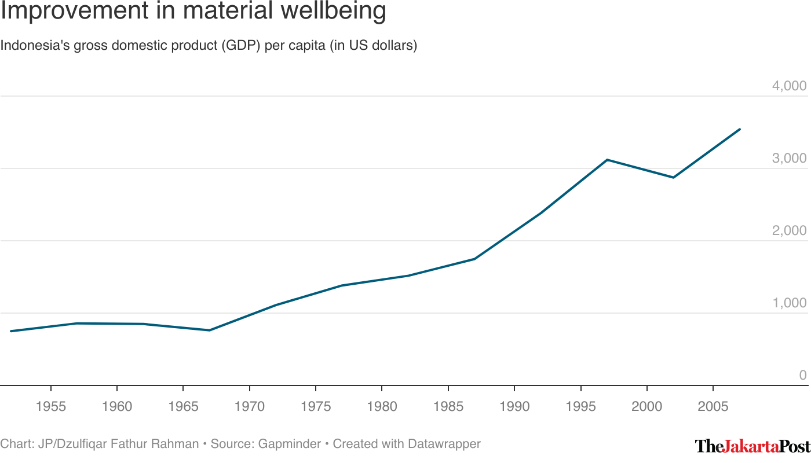

<!-- README.md is generated from README.Rmd. Please edit that file -->

# jakpoststyle

<!-- badges: start -->

<!-- badges: end -->

The `jakpoststyle` package allows users to apply the style I commonly
use in creating graphs on [Datawrapper](https://www.datawrapper.de/) for
The Jakarta Post using the helpful `DatawRappr` package developed by
[Benedict Witzenberger](https://github.com/munichrocker).

## Installation

With the package living on my GitHub account, users can install it as
follows:

``` r
devtools::install_github("dzulfiqarfr/jakpoststyle")
```

## Demo

Having created the chart and uploaded the data, users can use the
`jakpost_style()` function to edit the main chart properties like
`title`, `byline` and `y axis`.

The following code

``` r
library(jakpoststyle)

# Apply the function to an existing chart
jakpost_style(
  chart_id = # Insert the chart id here,
  chart_type = "line",
  y = gap_indo$gdpPercap, # Subset of data from `gapminder`
  scale_y_min_limit = 0, # Start the y axis from 0
  scale_y_max_limit = 500, # Raise the upper limit of the y axis range by 500
  axis_ticks_y = c(1000, -40), # Sets the breaks by 1,000 and subtracts the maximum value by 40
  headline = "Improvement in material wellbeing",
  subtitle = str_c(
    "Indonesia's gross domestic product (GDP) per capita ",
    "(in US dollars)"
  ),
  author = "Dzulfiqar Fathur Rahman",
  source = "Gapminder"
)
```

produced this chart:

<p align="center">



</p>

**NOTE: This is not an official template from The Jakarta Post.**
